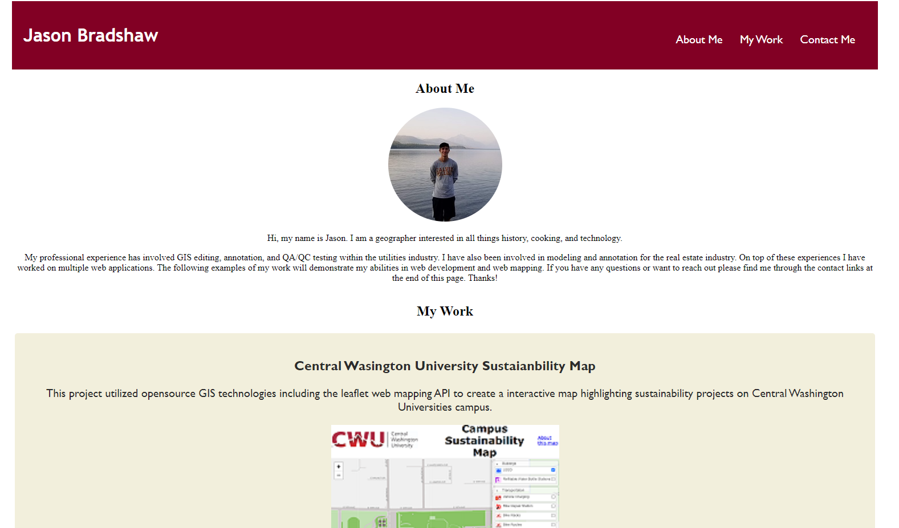

# Jason-_Bradshaw_Portfolio
This is my personal portfolio. 
The purpose is to highlight my experinces in web development and provide a central hub for people to see projects I have worked on. A short bio and contact information is also provided.

## Features
- nav bar at the top of the screen provide links to navigate the page.
- The about me section offers a short bio as well as a image of my self.
- the work section displays the first project across the whole page to highlight its importance.
- additional projects come after in there own boxes. 
- clicking the image for the project will bring you to a new page where the project is hosted.
- contact info is provided at the end of the page

## To Be Added
- additional projects that have and will be completed can be added
- css changes on hover of images to indicat clickability 
- keeping the nav bar locked to the top of screen for quick access

## Project Image

